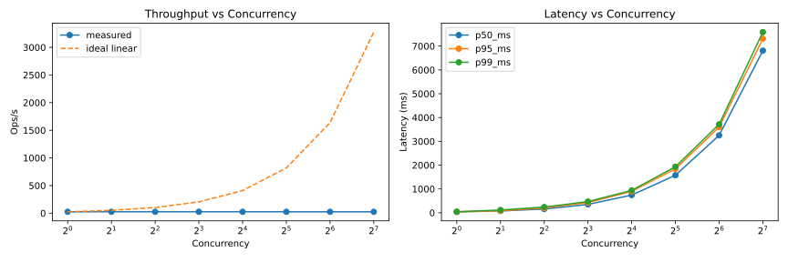
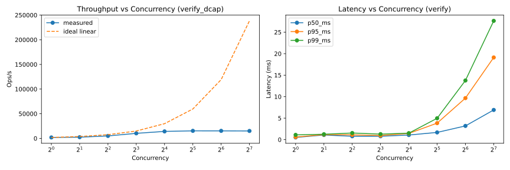
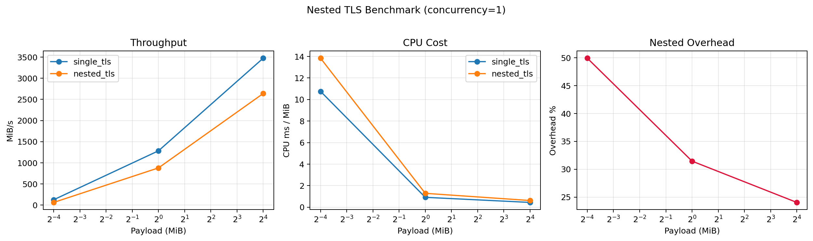

# attested-tls-benchmarks

Small Rust workspace for benchmarking components related to attested TLS.

This repo will contain multiple benchmarking programs over time.

Currently it includes:
- `crates/dcap-generate`: benchmark harness for DCAP quote generation workflows (with an FS baseline mode and a TDX quote mode).
  - Also supports a `verify` workload for benchmarking offline DCAP verification using local quote/collateral test vectors.

# Results

## DCAP Generation on GCP

```
concurrency  ops        failures   throughput/s   mean_ms    p50_ms     p95_ms     p99_ms     max_ms
1            200        0          25.588         39.078     38.946     40.276     40.748     41.100
2            400        0          25.680         77.684     77.674     81.223     116.981    117.513
4            800        0          25.609         154.951    155.651    200.289    239.039    272.946
8            1600       0          25.519         309.751    351.501    430.237    469.886    521.425
16           3200       0          25.477         612.495    743.713    899.543    940.691    1083.260
32           6400       0          25.332         1223.761   1575.090   1846.041   1932.947   2039.212
64           12800      0          25.171         2473.967   3251.411   3598.749   3715.820   3935.253
128          25600      0          24.769         5020.951   6807.242   7311.143   7586.950   7971.502
```



Basically this shows us that attestation generation takes around 39ms (which is longer than i expected). And it is highly serialized - two concurrent generations take almost exactly twice long as one generation.

## DCAP Verification with cached collateral 

Benchmark attestation verification with fixed local test data and a deterministic timestamp:

```bash
cargo run -p dcap-generate-benchmark -- \
  --workload verify \
  --concurrency 1,2,4,8 \
  --iters-per-worker 50 \
  --verify-now 1769509141
```

Defaults for `verify` workload:
- Quote: `crates/dcap-generate/test-data/dcap-tdx-1766059550570652607`
- Collateral: `crates/dcap-generate/test-data/dcap-quote-collateral-00.json`
- Expected report data:
  `74276a648f1fd491f474a2d52c72d850e3768157b43ec297a9917482bd77278ba1882588391d1956b6f6466ad8b8dccd55f57221ad81b420f746fa8db0f8637d`
- Timestamp: `1769509141`

On peg's computer (24 cores AMD Ryzen AI 9 HX 370) **with pre-fetched in-memory collateral**:

```
concurrency  ops        failures   throughput/s   mean_ms    p50_ms     p95_ms     p99_ms     max_ms
1            200        0          1861.895       0.536      0.509      0.595      1.105      1.411
2            400        0          2357.684       0.840      1.077      1.165      1.253      1.570
4            800        0          4953.148       0.780      0.785      1.111      1.543      1.664
8            1600       0          10189.188      0.764      0.785      0.948      1.285      1.658
16           3200       0          14119.984      1.103      1.072      1.448      1.503      2.036
32           6400       0          15239.759      2.035      1.681      3.840      4.971      7.894
64           12800      0          15211.749      4.060      3.193      9.662      13.761     27.784
128          25600      0          15018.145      8.197      6.910      19.117     27.636     49.533
```



With pre-loaded collateral, verification is fast (0.5ms) and can be parallelized - throughput saturates around ~15k ops/s at roughly 32 concurrency on my machine.

## DCAP Verification using Intel PCS each time

I didn't run the full benchmark as eventually i got a failed request, but here you can see that hitting the Intel PCS drastically slows things down, taking us over 1s.

```
concurrency  ops        failures   throughput/s   mean_ms    p50_ms     p95_ms     p99_ms     max_ms
1            5          0          0.909          1100.140   1038.311   1342.526   1342.526   1342.526
2            10         0          1.987          1004.059   951.845    1231.018   1231.018   1231.018
4            20         0          4.646          838.423    823.966    903.055    913.111    913.111
8            40         0          3.868          1015.033   839.536    1213.722   6394.085   6394.085
```

## Nested TLS

A payload of various sizes is transferred from client to server, locally via the loopback interface.

The whole duration of the connection is timed.  This includes:
- TCP connect/listen setup
- TLS handshake(s) (single_tls: 1, nested_tls: 2)
- Payload transfer
- ACK synchronization / flush 

Since the handshake itself is timed, we naturally see greater overhead for smaller payloads, as the handshake has more impact relative to bytes transferred.

```
mode         payload_bytes chunk_bytes  concurrency  rounds   fail     mean_MiB/s   cpu_ms/MiB wire/app   overhead_%
single_tls   65536        16384        1            200      0        100.725      11.762     2.056      NaN
single_tls   1048576      16384        1            200      0        1317.382     0.913      2.010      NaN
single_tls   16777216     16384        1            200      0        3246.547     0.447      2.007      NaN
nested_tls   65536        16384        1            200      0        63.131       13.777     2.096      37.323
nested_tls   1048576      16384        1            200      0        845.052      1.371      2.018      35.854
nested_tls   16777216     16384        1            200      0        2786.562     0.574      2.012      14.168
```

The `wire/app` metric is a measure of bytes on the wire relative to application bytes transferred.

```
(wire_tx_bytes + wire_rx_bytes) / total_app_bytes
```
Where wire bytes come from network interface counters, and app bytes are the payload bytes that were successfully sent.

Each app byte is counted once in TX and once in RX on the same host, so 2.0 is the baseline here. Higher values mean more on-wire overhead (headers/retransmits/etc.).

So we can see that with a large payload (16mb) overhead on the wire is minimal.

The `overhead_%` metric compares standard to nested TLS in terms of throughput penalty. So the penalty is significant, but bear in mind this is without network latency.  The extra overhead is from additional record processing and encryption, which is unlikely to be the bottleneck when network latency is also present.  Unless of course we have many concurrent connections. So lets look at the effect of concurrency.



### Nested TLS at various concurrency

```
mode         payload_bytes chunk_bytes  concurrency  rounds   fail     mean_MiB/s   cpu_ms/MiB wire/app   overhead_%
single_tls   65536        16384        2            200      0        142.531      12.162     2.056      NaN
single_tls   1048576      16384        2            200      0        2276.974     1.005      2.010      NaN
single_tls   16777216     16384        2            200      0        4519.120     0.603      2.007      NaN
nested_tls   65536        16384        2            200      0        95.351       16.256     2.096      33.102
nested_tls   1048576      16384        2            200      0        1295.792     1.602      2.018      43.091
nested_tls   16777216     16384        2            200      0        3053.775     0.993      2.012      32.425

mode         payload_bytes chunk_bytes  concurrency  rounds   fail     mean_MiB/s   cpu_ms/MiB wire/app   overhead_%
single_tls   65536        16384        4            200      0        291.516      10.873     2.056      NaN
single_tls   1048576      16384        4            200      0        3663.158     1.122      2.010      NaN
single_tls   16777216     16384        4            200      0        6156.713     0.751      2.007      NaN
nested_tls   65536        16384        4            200      0        50.104       21.625     2.096      82.813
nested_tls   1048576      16384        4            200      0        1798.636     2.108      2.018      50.899
nested_tls   16777216     16384        4            200      0        4811.110     1.119      2.012      21.856

mode         payload_bytes chunk_bytes  concurrency  rounds   fail     mean_MiB/s   cpu_ms/MiB wire/app   overhead_%
single_tls   65536        16384        8            200      0        188.389      13.527     2.056      NaN
single_tls   1048576      16384        8            200      0        4941.478     1.539      2.010      NaN
single_tls   16777216     16384        8            200      0        8929.671     0.846      2.007      NaN
nested_tls   65536        16384        8            200      0        36.233       32.754     2.096      80.767
nested_tls   1048576      16384        8            200      0        2405.290     3.157      2.018      51.324
nested_tls   16777216     16384        8            200      0        6775.913     1.358      2.012      24.119

mode         payload_bytes chunk_bytes  concurrency  rounds   fail     mean_MiB/s   cpu_ms/MiB wire/app   overhead_%
single_tls   65536        16384        16           200      0        125.147      21.240     2.060      NaN
single_tls   1048576      16384        16           200      0        3250.678     3.617      2.010      NaN
single_tls   16777216     16384        16           200      0        9205.622     1.153      2.007      NaN
nested_tls   65536        16384        16           200      0        39.660       30.503     2.103      68.309
nested_tls   1048576      16384        16           200      0        2863.854     4.410      2.018      11.900
nested_tls   16777216     16384        16           200      0        8716.455     1.766      2.012      5.314
```

In some cases we do see high overhead - up to 80% with a small payload. But the results are generally inconsistent (we see overhead of just 5% at 16 concurrency with 16mb payload). Which makes me think this is not a good benchmark.

### Nested TLS at various chunk sizes

Chunk size is just the number of bytes given in each `.write_all()` call on the stream when writing data.  It does not represent the number of bytes that the TLS implementation actually includes in a TLS record.  The TLS implementation uses buffering and splitting to optimise record size. But it is anyway likely to have an effect on record size, so worth investigating.

```
mode         payload_bytes chunk_bytes  concurrency  rounds   fail     mean_MiB/s   cpu_ms/MiB wire/app   overhead_%
single_tls   65536        65536        1            200      0        244.185      7.139      2.054      NaN
single_tls   1048576      65536        1            200      0        1838.952     0.698      2.010      NaN
single_tls   16777216     65536        1            200      0        3946.334     0.390      2.007      NaN
nested_tls   65536        65536        1            200      0        203.917      5.314      2.094      16.491
nested_tls   1048576      65536        1            200      0        1341.837     0.870      2.016      27.033
nested_tls   16777216     65536        1            200      0        2946.190     0.552      2.010      25.344
```

```
mode         payload_bytes chunk_bytes  concurrency  rounds   fail     mean_MiB/s   cpu_ms/MiB wire/app   overhead_%
single_tls   65536        1048576      1            200      0        241.089      7.928      2.056      NaN
single_tls   1048576      1048576      1            200      0        1908.721     0.654      2.010      NaN
single_tls   16777216     1048576      1            200      0        3569.474     0.403      2.007      NaN
nested_tls   65536        1048576      1            200      0        190.344      5.615      2.094      21.048
nested_tls   1048576      1048576      1            200      0        1128.835     0.979      2.015      40.859
nested_tls   16777216     1048576      1            200      0        2827.768     0.557      2.010      20.779
```

```
mode         payload_bytes chunk_bytes  concurrency  rounds   fail     mean_MiB/s   cpu_ms/MiB wire/app   overhead_%
single_tls   65536        8388608      1            200      0        129.533      11.277     2.056      NaN
single_tls   1048576      8388608      1            200      0        1344.044     0.940      2.011      NaN
single_tls   16777216     8388608      1            200      0        3581.327     0.436      2.007      NaN
nested_tls   65536        8388608      1            200      0        122.641      8.452      2.094      5.321
nested_tls   1048576      8388608      1            200      0        580.561      1.705      2.016      56.805
nested_tls   16777216     8388608      1            200      0        2357.218     0.707      2.010      34.180
```

Increasing chunk size doesn't have a significant effect on `wire/app` which is what i was concerned about, and `overhead_%` is inconsistent as with the other tests.

### Conclusion

We are not seeing a significant over-the-wire overhead which is what i was concerned about. We do see an impact on throughput but results are inconsistent and without testing on a real network deployment it is hard to know what impact this would really have in the wild. So next steps could be to test this on a deployment.
